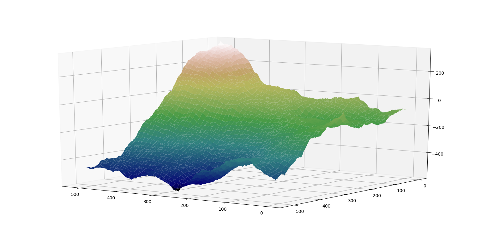

# Procedural_Generation_Erosion

## Description : ##
Procedural Generation of maps using FFT and Diamond square Algorithm. I add an erosion algorithm in order to improve quality of the random map

## Principe : ##

The diamond square algorithm create a map by setting point to a random value and point next to him close to that random value.

  

  

The algorithm isn't that realistic. I decided to use FFT to create the random maps. We set up an inital noise matrix. Each frequency will be seen as a spatial frequency. That's why we reduce high frequency in order to keep realistic ones. 

  

## Erosion : ##

To enhance realism, I add erosion algorithm to the generetion

  

### *Projet done for TIPE in preparatory classes for engineering school in 2018* ###
